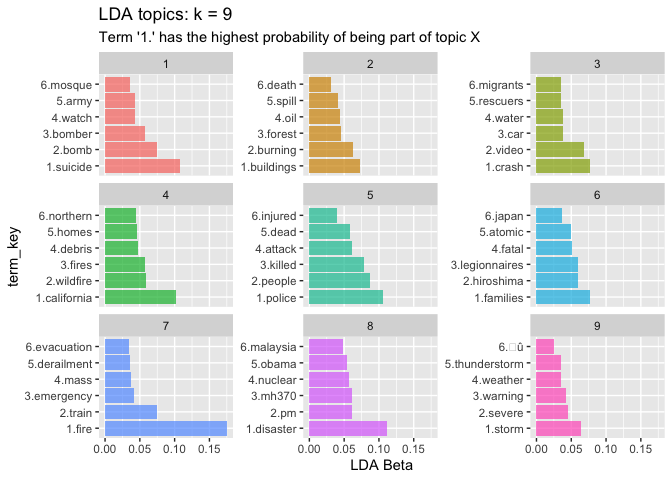
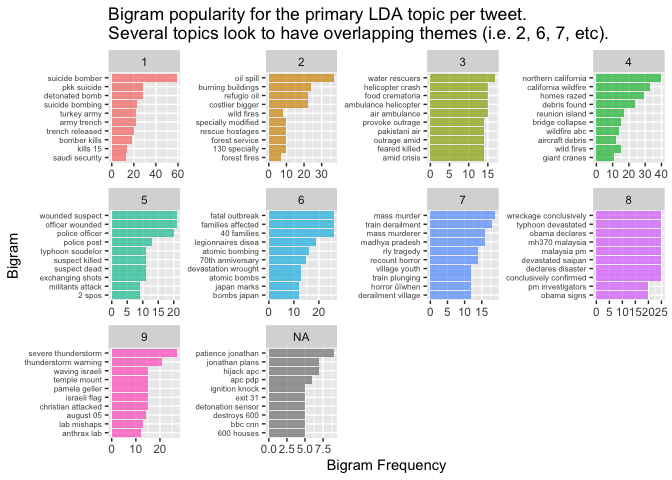
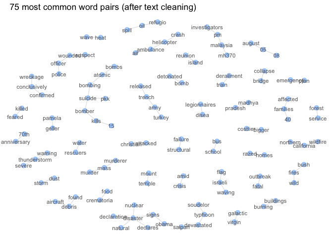
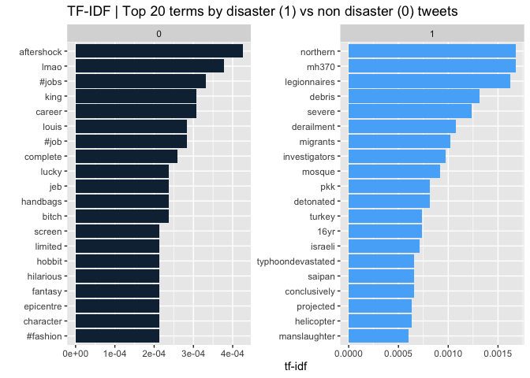

Disaster Tweet Text Analysis
================

# Packages

``` r
required_packages <- c('tidyverse', 'tidytext', 'topicmodels', 'broom', 
                       'caret', 'SnowballC', 'tm', 'gridExtra', 'igraph', 'ggraph')
for(p in required_packages) {
  if(!require(p,character.only = TRUE)) 
        install.packages(p, repos = "http://cran.us.r-project.org")
  library(p,character.only = TRUE)
}
pct_formater_1 <- scales::label_percent(accuracy = 1)
```

# Overview

  - This notebook covers popular techniques for text analysis /
    modeling.
  - Analysis is on a set of disaster and non disaster related tweets
    which have been hand classified.
  - [Kaggle data
    source](https://www.kaggle.com/c/nlp-getting-started/data?select=train.csv)

# Analysis investigation areas

1.  For the disaster tweets, can we use topic modeling to uncover what
    types of disasters are in the disaster tweets?

2.  Use data visualizations to explore bigrams for most common word
    patterns for disaster tweets and network visualizations to show
    common word pairs.

3.  Are there any terms that appear to be unique to disaster tweets?

4.  \[FUTURE TODO\] Use tweet content / attributes to predict if a tweet
    is a disaster tweet or not.

# Read in the data

``` r
df <- read_csv("tweets_training_disaster.csv")
glimpse(head(df, 5))
```

    ## Rows: 5
    ## Columns: 5
    ## $ id       <dbl> 1, 4, 5, 6, 7
    ## $ keyword  <chr> NA, NA, NA, NA, NA
    ## $ location <chr> NA, NA, NA, NA, NA
    ## $ text     <chr> "Our Deeds are the Reason of this #earthquake May ALLAH Forg…
    ## $ target   <dbl> 1, 1, 1, 1, 1

# Data description

  - id - a unique identifier for each tweet
  - text - the text of the tweet
  - location - the location the tweet was sent from (may be blank)
  - keyword - a particular keyword from the tweet (may be blank)
  - target - denotes whether a tweet is about a real disaster (1) or not
    (0)

Note the target column was generated by a human reviewer. In practice,
human labeling of an initial training set could be used to build a model
to classify unlabeled data.

# Feature enhancement

  - Add additional features for downstream modeling and EDA.

<!-- end list -->

``` r
df <- df %>%
  group_by(id) %>%
  mutate(hashtag_count = str_count(text, "#"),
         capital_letter_count = str_count(text, "[A-Z]"),
         at_mentions_count = str_count(text, "@"),
         question_mark_count = str_count(text, "\\?"),
         link_count = str_count(text, "http"),
         retweet_count = str_count(text, "RT "),
         # this could be a function to avoid the duplicative code here
         first_hashtag = ifelse(hashtag_count>=1, 
                                str_extract_all(text, "#\\w+")[[1]][1],
                                "no_hashtag"),
         second_hashtag = ifelse(hashtag_count>=2, 
                                str_extract_all(text, "#\\w+")[[1]][2],
                                "no_hashtag"),
         third_hashtag = ifelse(hashtag_count>=3, 
                                str_extract_all(text, "#\\w+")[[1]][3],
                                "no_hashtag"),
         fourth_hashtag = ifelse(hashtag_count>=4, 
                                str_extract_all(text, "#\\w+")[[1]][4],
                                "no_hashtag")) %>%
  ungroup()
```

# LDA topic modeling using term frequency

  - Create a function to explore different values for number of k
    topics.
  - Number of topics tends to be selected based on judgment call when
    additional k topics doesn’t seem to be making meaningful splits of
    new topics.
  - LDA() expects a frequency-weighted document-term matrix vs
    tf-idf-weighted

<!-- end list -->

``` r
custom_stop_words <- c("#news", "rt", "dont", "news", "|", "im", "û", "http",
                       "t.co", "û_", "https", "û_")

lda_topics_term_freq <- function(kvar, weight_var) {
tweets_dtm <- df %>% 
      filter(target==1) %>%
      # function to replace target text with blank
      mutate(text = str_remove_all(text, c("&amp"))) %>%      
      unnest_tokens(output = term, input = text, token = "tweets") %>%
      filter(!term %in% stop_words$word,
             !term %in% custom_stop_words,
             !str_detect(term, "http"),
             !str_detect(term, "^[0-9]*$"),
             !str_detect(term, "@")) %>%
      # option to use word steams 
      # mutate(stem = wordStem(term)) %>%
      count(id, term) %>%
      cast_dtm(document = id, term = term, value = n)

# drop terms that only occur in low volume of tweets
tweets_dtm2 <- removeSparseTerms(tweets_dtm, .995)

rowTotals <- apply(tweets_dtm2 , 1, sum) #Find the sum of words in each Document
tweets_dtm3   <- tweets_dtm2[rowTotals> 0, ] #Remove rows without the non sparse words

lda_out <- LDA(
  tweets_dtm3,
  k = kvar,
  method = "Gibbs",
  control = list(seed = 42)
)

lda_out %>%
      tidy(matrix="beta") %>%
      group_by(topic) %>%
      slice_max(beta, n = 6, with_ties=F) %>%
      arrange(-beta) %>%
      mutate(group_rank = row_number(),
             term_key = paste0(group_rank,".",term)) %>%
      ungroup() %>%
      ggplot(aes(x=beta, y=term_key, fill=factor(topic))) +
      geom_col(alpha=0.7) +
      labs(title=paste0("LDA topics: k = ", kvar),
           x="LDA Beta") +
      facet_wrap(.~topic, scale="free_y") +
      theme(legend.position = "none")
}
```

# Optimal k topics

  - After some iteration, seems that at least 9 disaster topics are
    present in the disaster tweets segment of the data.

<!-- end list -->

1)  Suicide bomb, 2) Building fire, 3) Car crash in water, 4) CA
    wildfires, 5) Police attack, 6) Atomic bomb, 7) Train fire, 8) mh370
    mystery, 9) Severe weather

<!-- end list -->

  - Future TODO: reverse order of y axis in the plot. Not able to
    relevel factors by group. Hacky solution for now.

<!-- end list -->

``` r
lda_topics_term_freq(9) +
  labs(subtitle = "Term '1.' has the highest probability of being part of topic X")
```

<!-- -->

# Assign tweets a primary topic

``` r
tweets_dtm <- df %>% 
      filter(target==1) %>%
      # function to replace target text with blank
      mutate(text = str_remove_all(text, c("&amp"))) %>%      
      unnest_tokens(output = term, input = text, token = "tweets") %>%
      filter(!term %in% stop_words$word,
             !term %in% custom_stop_words,
             !str_detect(term, "http"),
             !str_detect(term, "^[0-9]*$"),
             !str_detect(term, "@")) %>%
      # option to use word steams 
      # mutate(stem = wordStem(term)) %>%
      count(id, term) %>%
      cast_dtm(document = id, term = term, value = n)

# drop terms that only occur in low volume of tweets
# results in some tweets being dropped for topic modeling process
tweets_dtm2 <- removeSparseTerms(tweets_dtm, .995)

rowTotals <- apply(tweets_dtm2 , 1, sum) # Find the sum of words in each Document
tweets_dtm3   <- tweets_dtm2[rowTotals> 0, ] # Remove rows without the non sparse words

lda_out <- LDA(
  tweets_dtm3,
  k = 9,
  method = "Gibbs",
  control = list(seed = 42)
)

doc_topics <- tidy(lda_out, matrix = "gamma") %>% 
  group_by(document) %>%
  # approach for assigning a document a primary topic
  mutate(topic_rank = rank(desc(gamma),  ties.method="random")) %>% 
  ungroup() %>%
  filter(topic_rank==1) %>%
  rename(id = document) %>%
  mutate(id = as.numeric(id)) %>%
  dplyr::select(id, topic)
```

# Bigram visualizations

  - This code could also be modified for trigrams.
  - We’ll use bigrams to investigate the LDA model topics which were
    derived using unigram term frequency.
  - LDA model could also be built with bigrams.
  - NA topic appears as some tweet documents get dropped in the modeling
    process due to sparse term frequency.
  - If we don’t drop sparse terms we’d expect all documents to receive a
    primary topic assignment.

<!-- end list -->

``` r
top_bigrams <- df %>% 
  filter(target==1) %>%
  left_join(doc_topics) %>%
  # function to replace target text with blank
  mutate(text = str_remove_all(text, c("&amp"))) %>%      
  unnest_tokens(output = bigram, input = text, token = "ngrams", n=2) %>%
  separate(bigram, c("word1", "word2"), sep = " ") %>%
  filter(!word1 %in% c(custom_stop_words, stop_words$word)) %>%
  filter(!word2 %in% c(custom_stop_words, stop_words$word)) %>%
  group_by(topic) %>%
  count(word1, word2, sort = TRUE) %>%
  slice_max(n, n = 10, with_ties = F)

top_bigrams %>%
      unite(bigram, word1:word2, sep=" ") %>%
      ggplot(aes(x=n, y=reorder(bigram, n), fill=factor(topic))) +
      geom_col(alpha=0.7) +
      labs(title="Bigram popularity for the primary LDA topic per tweet.
Several topics look to have overlapping themes (i.e. 2, 6, 7, etc).",
           y="Bigram",
           x="Bigram Frequency") +
      facet_wrap(.~topic, scale="free") +
      theme(legend.position = "none",
            axis.text.y = element_text(size=6))
```

<!-- -->

# Bigram network visualization to assess disaster tweet topics

  - Network graphs provide another angle for summarizing topics across
    documents (aka tweets for this analysis).
  - Chart below highlights most common word pairs for the disaster
    tweets.

<!-- end list -->

``` r
ngraph <- df %>% 
  filter(target==1) %>%
  mutate(text = str_remove_all(text, c("&amp"))) %>%      
  unnest_tokens(output = bigram, input = text, token = "ngrams", n=2) %>%
  separate(bigram, c("word1", "word2"), sep = " ") %>%
  filter(!word1 %in% c(custom_stop_words, stop_words$word)) %>%
  filter(!word2 %in% c(custom_stop_words, stop_words$word)) %>%
  count(word1, word2, sort = TRUE) %>%
  slice_max(n, n = 75, with_ties = F) %>%
  ungroup() %>%
  dplyr::select(word1, word2, n) %>%
  graph_from_data_frame()

set.seed(123)
a <- grid::arrow(type = "closed", length = unit(.15, "inches"))
ggraph(ngraph, layout = "fr") +
  geom_edge_link(color="grey90", alpha=0.95) +
  geom_node_point(color = "dodgerblue", size = 3, alpha=0.4) + 
  geom_node_text(aes(label = name), size=3, color="grey40") +
  theme_void() +
  labs(title = "    75 most common word pairs (after text cleaning)")
```

<!-- -->

# Term frequency-inverse document frequency

  - Compare disaster tweets vs non disaster tweets.
  - We can use td-idf metric to get a feel for what words are likley to
    appear in the disaster tweets and not appear in the non disaster
    tweets.

<!-- end list -->

``` r
df %>% 
      mutate(text = str_remove_all(text, c("&amp"))) %>%      
      unnest_tokens(output = term, input = text, token = "tweets") %>%
      filter(!term %in% stop_words$word,
             !term %in% custom_stop_words,
             !str_detect(term, "http"),
             !str_detect(term, "^[0-9]*$"),
             !str_detect(term, "@")) %>%
      count(target, term) %>% 
      bind_tf_idf(term, target, n) %>%
      group_by(target) %>%
      slice_max(tf_idf, n = 20, with_ties = F) %>%
      ungroup() %>%
      ggplot(aes(x=tf_idf, y=fct_reorder(term, tf_idf), fill = target)) +
      geom_col(show.legend = FALSE) +
      facet_wrap(~target, ncol = 2, scales = "free") +
      labs(title = "TF-IDF | Top 20 terms by disaster (1) vs non disaster (0) tweets",
        x = "tf-idf", 
        y = "")
```

<!-- -->

# Predict if a tweet is a disaster tweet or not

  - FUTURE TODO
  - Build supervised classification model which uses a dtm or tf-idf

# Notes / reminders

  - Document term matrix (DTM): rows as documents and columns as terms.
    The terms typically are words but could also be ngrams. Think of
    this a sparse matrix with a bunch of indicator variables.
  - Document could be a book, person, tweet, etc. Anything that relates
    to the analysis investigation.
  - Terms can also represent non text related things.
  - Tokenizing = breaking a human readable text string into machine
    readable elements.
  - Stemming is sometimes helpful to reduce word iterations down.
  - TF-IDF: term frequency inverse document frequency.
  - Compare tf vs tf-idf to see if one is better than the other when
    using as supervised model input.
  - When doing supervised modeling, important to remove sparse features
    and simplify the document-term matrix as much as possible - the more
    text features and observations in the document-term matrix, the
    longer it takes to train the model.
  - Pyramid plots can be useful for showing text trends.

##### LDA

  - LDA model output: how much each topic contributes to each document &
    how much each word contributes to each topic.
  - E.g. each topic is a collection of word probabilities for all of the
    unique words used in the corpus.
  - With LDA models, we can use denograms with hellinger distance to see
    if topics are closely related.
  - Once we see that adding a new topic appears duplicate an existing
    topic, we know we’ve gone too far and can reduce k.
  - We can name the topics based on what the words with high probability
    appear to be indicating.
